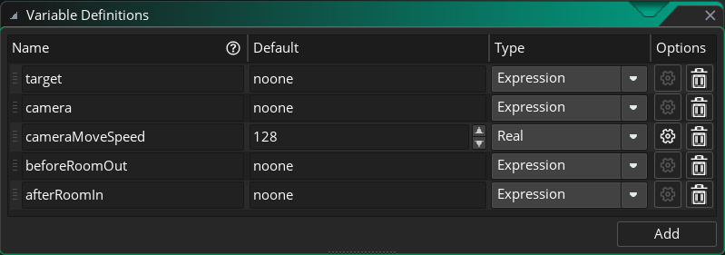

# GMS2MetrovaniaMapSystem
GMS2银河恶魔城地图系统

## 使用
将 `GMS2Camera` 中的 `obj_Camera` 拖入场景

将 `GMS2MetrovaniaMapSystem` 中的 `obj_GMS2MMSController` 拖入场景

正确配置 `obj_GMS2MMSController` 对象，至少配置 `target` 和 `camera` 属性

在场景中加入任意数量的 `obj_GMS2MMSRoom` 对象

## 参考

### obj_GMS2MMSController
#### 配置项

名称 | 功能
--- | ---
target | 相机追踪对象
camera | 相机对象
cameraMoveSpeed | 房间切换时，镜头移动速度
beforeRoomOut | target离开当前房间时，触发此脚本
afterRoomIn | target进入房间后，触发此脚本

### obj_GMS2MMSRoom
该对象继承了 `GMS2Trigger` 中的 `obj_GMS2Trigger` ，没有其他额外提供的功能，拖入场景后也不需要其他配置。